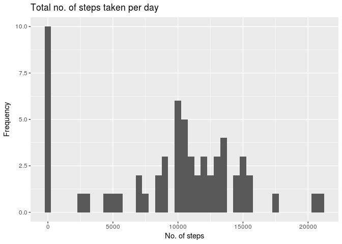
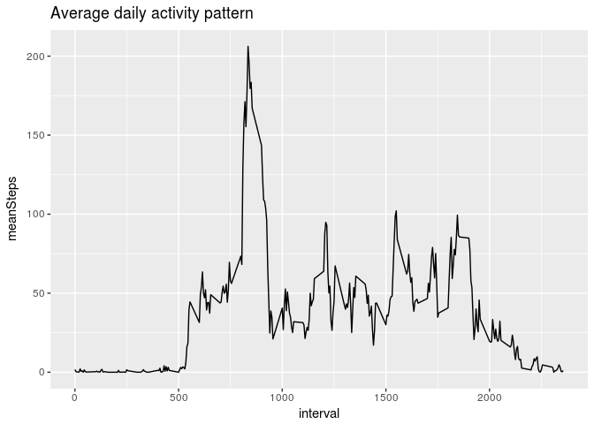
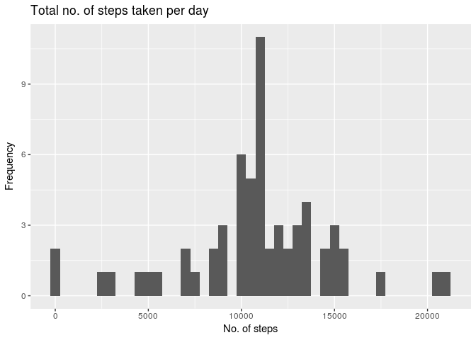
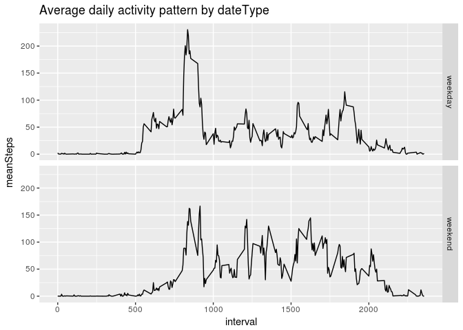

# Reproducible Research: Peer Assessment 1


## Loading libraries

```r
library(dplyr)
library(timeDate)
library(ggplot2)
```

## Loading and preprocessing the data

```r
zipfile <- "activity.zip"
filename <- "activity.csv"
if(!file.exists(filename)) {
    unzip(zipfile)
}
activity <- read.csv(filename, header = TRUE)
```

## What is mean total number of steps taken per day?

1. Plotting total no. of steps taken per day

```r
stepsPerDay <- tapply(activity$steps, activity$date, sum, na.rm=TRUE)
qplot(stepsPerDay, main = "Total no. of steps taken per day", xlab = "No. of steps", ylab= "Frequency", binwidth = 500)
```

<!-- -->

2. Mean and median total number of steps per day

```r
meanStep <- mean(stepsPerDay)
medianStep <- median(stepsPerDay)
```
* Median total number of steps taken per day = __10395__
* Mean total number of steps taken per day = __9354.2295082__

## What is the average daily activity pattern?

1. Finding out Average Steps per Day

```r
by_interval <- activity %>% filter(!is.na(steps)) %>% group_by(interval)
avgStepsPerDay <- summarise(by_interval, meanSteps = mean(steps))
```

2. Plotting Average Steps per day vs interval

```r
g <- ggplot(avgStepsPerDay, aes(y = meanSteps, x = interval))
g + geom_line() + labs(title = "Average daily activity pattern", xlab= "Interval", ylab = "Average no. of steps taken")
```

<!-- -->

3. Finding out which interval has maximum number of steps

```r
maxStep <- avgStepsPerDay %>% filter(meanSteps == max(meanSteps))
maxStepInterval <- maxStep[,1]
```
* The interval which contains maximum number of steps is __835__

## Imputing missing values

1. No of rows with NA values

```r
missingData <- sum(!complete.cases(activity))
```
* Number of rows with NA is __2304__

2. Filling in the NA values and imputing into new dataset

```r
activityNew <- activity %>% group_by(interval) %>%
                    mutate(steps = replace(steps, is.na(steps),
                                           mean(steps, na.rm = TRUE)))
```

3. Histogram of the new dataset

```r
stepsPerDay <- tapply(activityNew$steps, activityNew$date, sum)
qplot(stepsPerDay, main = "Total no. of steps taken per day", xlab = "No. of steps", ylab= "Frequency", binwidth = 500)
```

<!-- -->

4. Mean and median total number of steps per day

```r
meanStep <- mean(stepsPerDay)
medianStep <- median(stepsPerDay)
```
* Median total number of steps taken per day = __1.0766189\times 10^{4}__
* Mean total number of steps taken per day = __1.0766189\times 10^{4}__

## Are there differences in activity patterns between weekdays and weekends?
1. Creating a new factor variable 

```r
activityNew$dateType <- ifelse(as.POSIXlt(activityNew$date)$wday %in% c(0,6),
                               'weekend','weekday')
```

2. Make a panel plot using time series

```r
by_interval <- activityNew %>% group_by(interval, dateType)
avgStepsPerDay <- summarise(by_interval, meanSteps = mean(steps))
ggplot(avgStepsPerDay, aes(interval, meanSteps)) + geom_line() + facet_grid( dateType ~ .) + labs(title = "Average daily activity pattern by dateType", xlab= "Interval", ylab = "Average no. of steps taken")
```

<!-- -->

